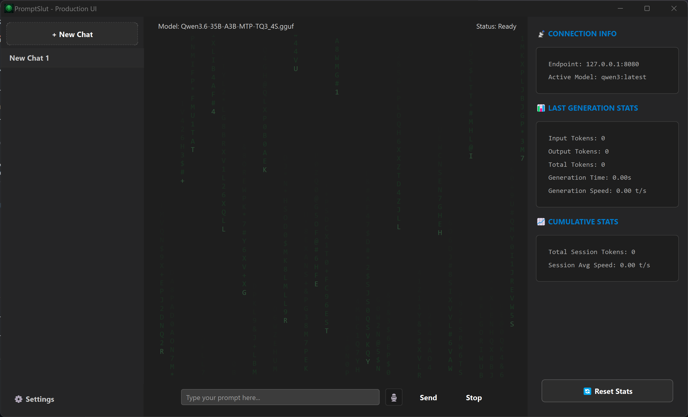
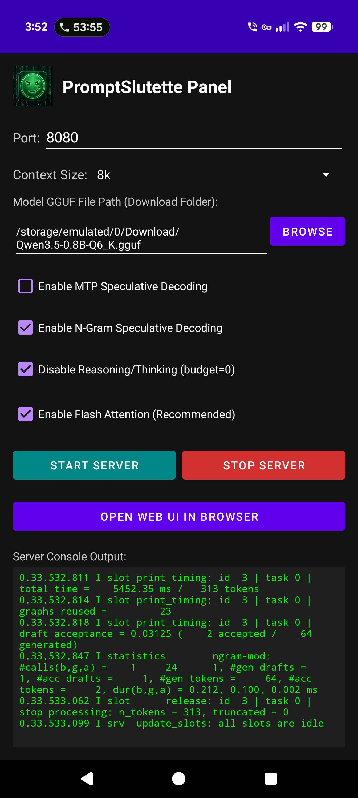

# PromptSlut (v0.82)

PromptSlut is a native, highly optimized C++ and Qt6 frontend designed to connect to any OpenAI-compatible endpoint. It is paired with an integrated local Python voice engine for always-on assistant voice loops and includes an Android companion project (Promptslutette) so you can run a local, lightweight vector model on a spare phone for memory storage and code analysis.

This project focuses on keeping everything local, private, and running directly on your own system. It was designed to run Qwen 3.6 35B A3B as the main desktop model, and Qwen 3.5 0.8B for the mobile phone model, though any OpenAI-compatible API endpoint or local model of your choice can be easily configured.

We are currently at v0.82, representing a highly functional release that is actively being polished and tweaked toward a 1.0 release.

> **Personal Note and Disclosure**
> 
> I am developing this project solo. I learned C++ in college many years ago, but I have also been using modern AI assistance to help design and build this application.
> 
> As an autistic developer, releasing this project to the public is a big step for me, so please be gentle! I am just trying my best to make something cool and useful that others might enjoy. :)

---

## Screenshots

### Desktop Client GUI

### Mobile Phone Client GUI (Promptslutette)

---

### Net Search and Serper Key Configuration
To enable the built-in search tool so the model can browse the internet for real-time information, a free Serper API key is required.
1. Go to the [Serper Signup Page](https://serper.dev/signup) to create a free account.
2. Click **API Keys** on the left sidebar menu.
3. Click **Create new key** in the top right corner.
4. Copy the generated key, open the PromptSlut desktop settings panel (⚙️), and paste it directly into the Serper field.

---

## Key Core Features

### Always-On Audio Echo Cancellation (AEC)
The voice system features built-in subtractive gating and Acoustic Echo Cancellation (AEC). This filters out system sounds and speech playing from your speakers so that the microphone never captures its own output, allowing desktop mic users to speak freely without the model hearing itself.

### Dynamic User Profile Memory System
PromptSlut features an active user memory consolidation system. Between turns, the secondary model runs lightweight profile-extraction prompts to extract permanent personal facts about you (such as your name, preferences, likes, and dislikes). These are merged with your existing memory profile, allowing the assistant to become increasingly friendly, personal, and knowledgeable about you over time.

### Overhauled, Cross-Platform Desktop Tools & Context Engine (New in v0.82)
The tool calling pipeline and context orchestration have been completely re-engineered to provide OpenCode-level robust task execution and virtually infinite conversation memory:
- **Infinite sliding-window context compression**: When context usage crosses a 75% limit, PromptSlut synchronously partitions history into a *Hot Zone* (keeping the last few turns 100% raw for fresh continuity) and a *Cold Zone*. 
- **Automated local markdown archiving**: The Cold Zone turns are cleanly formatted and appended to `sessions/archive_<id>.md`.
- **Asynchronous Memory Consolidation**: The Cold Zone is compressed by the secondary model in the background into a high-density *Memory Digest* and injected back into the active system prompt. The model can use its tools to "teleport" back and read the raw archive file if it ever needs full, exact recall!
- **Base64 Payload Stripping**: Massive Base64 multimodal data (images and native audio) are automatically stripped from the conversation history immediately upon turn completion and replaced with tiny text placeholders. This lowers prompt load by up to **98%** and keeps context evaluation (prefill) latency at absolute zero!
- **Dynamic Context limit checking**: Automatically queries the active `llama-server` `/props` endpoint on startup to detect the exact context size (e.g. `64,000` tokens for Gemma) and scales context bar constraints dynamically.
- **Resilient Path Resolution**: Relative paths are automatically resolved against the absolute root directory of your active workspace, completely avoiding "file not found" errors.
- **Robust Multi-line Input**: The desktop client features a multiline prompt area with automatic scrollbars, word wrapping, and standard Shift+Enter handling.
- **Persistent Chat Sessions**: Your chats are automatically saved to your `sessions/` folder and restored cleanly upon launching the application.
- **Native File Operations**: File copy, move, rename, and delete are handled using native C++ APIs with automatic folder scaffolding, meaning models no longer have to guess Windows shell commands.
- **Self-Repairing JSON**: Automatically detects and repairs common model path formatting errors (like unescaped backslashes `\`) before parsing.
- **Exit Code Propagation**: Shell command failure states are reported clearly with exit codes to prevent the model from getting stuck in hallucination loops.
- **Precision Tokens/Sec tracking**: Generation speed is computed by parsing the exact `predicted_ms` timing parameter directly from llama-server's JSON, giving 100% accurate tokens/sec speeds.

---

## Architecture Overview

* **C++/Qt6 Frontend:** Native compiled desktop interface that manages chat sessions, tool dispatching, and asynchronous workers. It is built to be fast and completely lag-free.
* **Python Voice Engine:** A FastAPI background service handling TTS (via Kokoro) and STT (via Whisper).
* **Promptslutette (Android)**: A companion APK and source tree that lets you turn an old Android phone into a dedicated local assistant node over the local network.

---

## Cool Engineering Tricks Under the Hood

We built this project to solve several real-world performance and hardware compatibility issues:

### 1. Soundcard and Audio Interface Downmixing with Native Resampling
Multi-channel professional USB soundcards and external audio interfaces lock their hardware clocks strictly to native sample rates (44100Hz or 48000Hz) and capture stereo or multi-input streams. Standard 16kHz voice activation engines often capture silent or static noise on these interfaces. 
To fix this, our Python engine queries your hardware's native sample rate, opens the stream cleanly at that native rate, downmixes stereo inputs on-the-fly, and uses linear interpolation to resample the audio block to 16000Hz before passing it to openwakeword. It works flawlessly regardless of which input channel your mic is plugged into.

### 2. On-Demand Model Downloader with Live GUI Progress
To keep the Git repository under 10MB, the large model files (over 300MB total) are excluded from source control. When the voice engine starts, it checks if any required models are missing and downloads them from release mirrors in a background thread. 
While downloading, it pipes live percentage and progress metrics to the C++ frontend, which displays a glowing orange status message on the desktop window until completion.

### 3. Decoupled Process Management (Zero GUI Freeze)
Instead of blocking the main thread while starting the local Python backend, the C++ client uses startDetached to spawn the service instantly. It tracks the backend via its process ID (PID) and terminates it cleanly on exit using native Win32 process handles. This keeps the GUI 100% responsive.

### 4. Atomic State Guard and Bypass
To prevent audio thread conflicts and system crashes, the callback loop uses an atomic threading lock. The moment a wake word is triggered, further wake-word predictions and microphone input processing are completely muted and bypassed. The microphone is safely re-armed only after Whisper finishes transcribing and clears its buffer.

### 5. CPU Optimization
The C++ synthesizers and Whisper decoders are configured via CMake to compile with maximum vectorization flags (-march=native). This compiles the code specifically for your processor's modern SIMD instruction sets (AVX2, AVX-512, and FMA), speeding up processing significantly on the CPU.

---

## Quick Start

### Build Desktop Client
1. Double-click `get_deps.bat` to fetch header dependencies.
2. Double-click `build_env.bat` to clean, configure, and compile with native optimizations.
3. The executable and all required assets will build directly into `build/bin/`.

### Run Voice Server
Ensure Python is installed, then run the executable from `build/bin/`. Enabling Voice Mode or Handsfree in the GUI will automatically launch and configure the background Python voice server.
